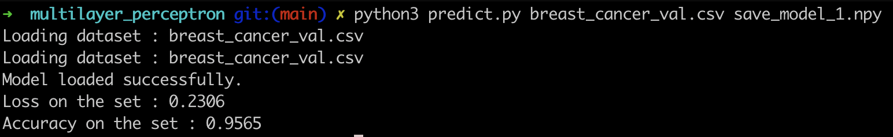
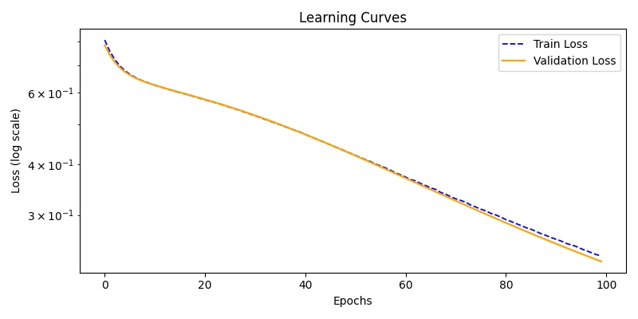
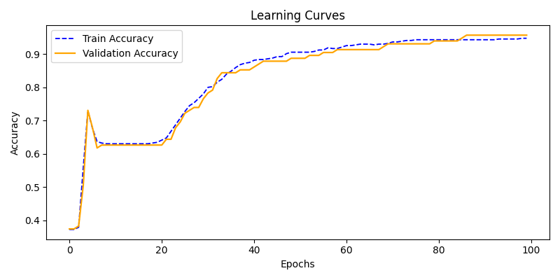
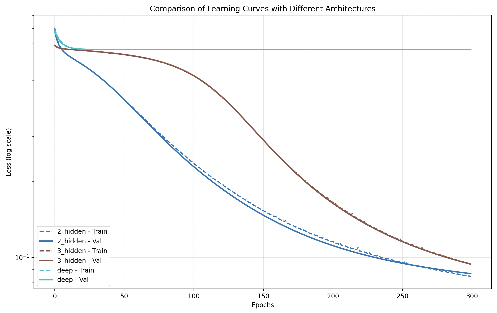

<h1> MULTILAYER PERCEPTRON </h1>

 
  
   
   
   

<h2> Description </h2>

Multilayer Perceptron est un projet de Machine Learning consistant à implémenter un réseau de neurones artificiels from scratch.

<h4> Objectifs: </h4>

•  Comprendre les réseaux de neurones  
•  Implémenter un MLP sans framework  
•  Manipuler les mathématiques du ML  
•  Appliquer la backpropagation  
•  Travailler avec un dataset réel  

Le modèle permet de prédire si une tumeur est bénigne ou maligne

<h4> C’est quoi un MLP ? </h4>

Un Multilayer Perceptron (MLP) est un réseau de neurones composé de:
•  une couche d’entrée  
•  une ou plusieurs couches cachées  
•  une couche de sortie  

Chaque neurone applique :
•  une somme pondérée  
•  une fonction d’activation  

C’est un modèle de type feedforward

<h2> Fonctionnement </h2>

<h4> Forward propagation </h4>
•  Les données passent de couche en couche  
•  Chaque couche transforme les données  
•  Une prédiction est produite  

<h4> Backpropagation </h4>
•  Calcul de l’erreur  
•  Propagation du gradient  
•  Mise à jour des poids  

Basé sur la descente de gradient

<h4> Dataset </h4>
•  Données médicales (cancer du sein)  
•  Classification:  
  &nbsp;&nbsp;&nbsp;•  M → Malignant  
  &nbsp;&nbsp;&nbsp;•  B → Benign  
 
⚠️ Nécessite :  
•  preprocessing  
•  normalisation  

<h2> Features </h2>
•  Implémentation from scratch  
•  Réseau multi-couches  
•  Backpropagation  
•  Gradient descent  
•  Softmax / fonctions d’activation  
•  Split training / validation  
•  Calcul de loss  

<h2> Fonctionnement </h2>
•  Initialisation des poids aléatoires  
•  Forward pass → prédiction  
•  Calcul de la loss  
•  Backpropagation  
•  Mise à jour des poids  

<h2> Installation </h2>

    git clone https://github.com/epraduro/multilayer_perceptron.git
    cd multilayer_perceptron

<h2> Split Training / Validation dataset </h2>

    python3 split_data.py <path_to_data.csv>

<h2> Entraînement </h2>

    python3 train.py 
⚠️ Il est possible de modifier les parametres d'entrainement:

    python3 train.py --e 300 --l 30 16 8 4 1 

  Ici on modifie le nombre d'epochs (dans cet exemple: 300 passages sur le dataset d'entrainement) et le nombre de couche cachée (les étapes intermédiaires entre l'entrée et la sortie du réseau de neurones).

<h4> Exemple de sortie </h4>

    Epoch 10/100 - loss: 0.12 - val_loss: 0.15
    Epoch 20/100 - loss: 0.08 - val_loss: 0.11

<h2> Prédiction </h2>

    python3 predict.py <data_file.csv> <model_file.npy>

 

  
 

<h2> Résultats </h2>
Modèle capable de généraliser sur données inconnues  
 

 

<h2> Bonus </h2>

Implémentation de plusieurs modèles entrainés avec des nombres de couches cachées différentes:

  

